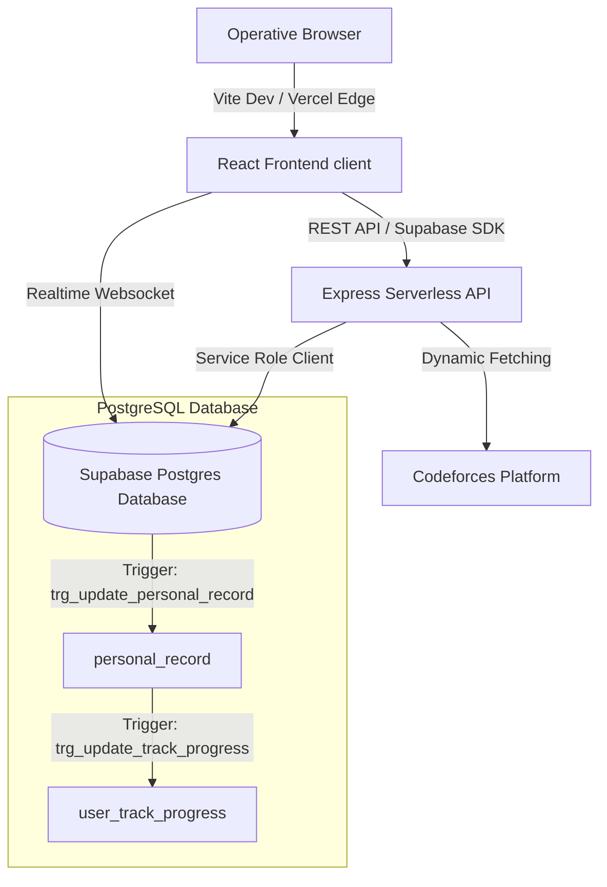

# 🌌 SIBYLJUDGE

[](https://sibyljudge-starter.vercel.app/)
[](#)
[](#)

> ** clearance code verified: access granted **  
> **Welcome to the SibylJudge Mainframe.** A state-of-the-art competitive programming training platform designed with futuristic aesthetics, cognitive practice tracks, automatic scraping, live coding contests, and real-time multiplayer groups.

### 🌐 [Live Deployment Mainframe](https://sibyljudge-starter.vercel.app/)

---

## ⚡ Mainframe Features

* 🧠 **Cognitive Training Tracks**: Immersive practice paths automatically curated from popular problem tags (DP, Greedy, Binary Search, Trees, etc.) to upgrade your rating step-by-step.
* 🏁 **Algorithmic Contests**: Host or participate in custom-tailored coding challenges. Live standings track scores and submission updates.
* 💬 **Mainframe Discussions**: Talk tactics, publish problem editorials, and debug code with standard markdown previewing.
* 👥 **Operative Groups**: Assemble a division, discuss algorithms in real-time chat, and compare metrics.
* 🤖 **Automatic Scraper Seeding**: Native scraping engine targeting the Codeforces API to dynamically populate problem sets.

---

## 🛠️ System Architecture



---

## 🚀 Quickstart Local Setup

### 1. Clone & Install Dependencies
Run the unified installer script in the root directory:
```bash
npm install
```
*This will automatically install packages inside both `/frontend/client` and `/backend/server`.*

### 2. Configure Environment Files
Create a `.env` file in the **`/backend/server`** directory:
```env
PORT=5050
SUPABASE_URL=YOUR_SUPABASE_URL
SUPABASE_SERVICE_ROLE_KEY=YOUR_SERVICE_ROLE_KEY
```

Create a `.env` file in the **`/frontend/client`** directory:
```env
VITE_SUPABASE_URL=YOUR_SUPABASE_URL
VITE_SUPABASE_ANON_KEY=YOUR_SUPABASE_ANON_KEY
```

### 3. Spin Up Mainframe
Start the backend API server:
```bash
cd backend/server
npm run dev
```

Start the frontend development server:
```bash
cd frontend/client
npm run dev
```
Navigate to `http://localhost:5173/` in your browser.

---

## 💾 Seeding Mainframe Data

To seed the database with mock users, curriculum tracks, active contests, discussion threads, and mock submissions, execute the seeder script from the backend directory:

```bash
cd backend/server
node scripts/seed-all-data.js
```

### Generated Seed Credentials:
* **Admin Operative**: `admin@sibyljudge.com` / `AdminPassword123!`
* **Pro Coder**: `coder_pro@sibyljudge.com` / `CoderPassword123!`
* **Algo Master**: `algo_master@sibyljudge.com` / `AlgoPassword123!`

---

## 📦 Vercel Deployment Settings

The repository is pre-configured for **monorepo deployment** using `vercel.json`. 

Ensure the following variables are defined in the **Environment Variables** tab of your Vercel Project:
* `PUBLIC_SUPABASE_URL`
* `SUPABASE_SERVICE_ROLE_KEY`
* `VITE_SUPABASE_URL`
* `VITE_SUPABASE_ANON_KEY`
